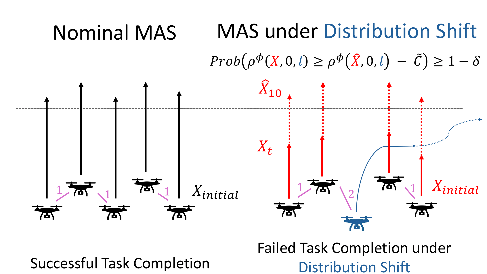

<small>Left: A drone swarm reaching a goal configuration with communication cost (in terms of communication time in seconds) in pink. Right: The swarm with an adversarial agent (an agent, here in blue, purposely not following the nominal control strategy) performing the same task inducing a distribution shift.</small>

